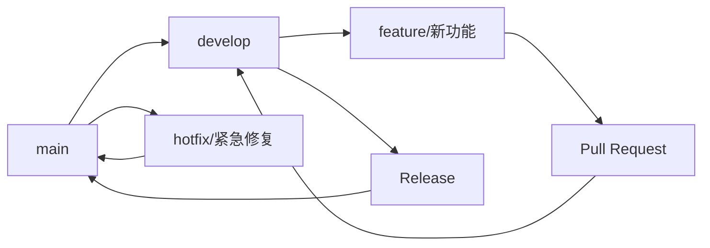

# TMH项目 GitHub仓库管理指南

## 项目概述

**TMH (Temperature, Mass Flow, Humidity)** 是一个铁矿石冶金性能综合检测与控制系统，版本 1.1.250907。该系统包含桌面应用程序和Web系统两个主要组件，用于工业控制和数据采集。

### 项目信息
- **版本**: 1.1.250907
- **作者**: Shi Jinpeng/USTB (北京科技大学)
- **发布日期**: 2025-09-08
- **版权**: © 2025 北京科技大学. All rights reserved.
- **联系邮箱**: shijinpeng06@126.com
- **官网**: https://www.ustb.edu.cn

## 仓库结构

```
TMH/
├── .gitignore                     # Git忽略文件配置
├── README.md                      # 项目说明文档
├── LICENSE                        # 开源许可证
├── CHANGELOG.md                   # 版本更新日志
├── CONTRIBUTING.md                # 贡献指南
├── docs/                          # 项目文档目录
│   ├── GITHUB_REPOSITORY_MANAGEMENT_GUIDE.md  # 本文档
│   ├── GIT_WORKFLOW_GUIDE.md      # Git工作流程指南
│   ├── BUILD_GUIDE.md             # 构建指南
│   ├── custom_experiment_guide.md # 自定义实验指南
│   ├── experiment_config_gui_guide.md # 实验配置GUI指南
│   ├── TMH系统数据采集逻辑.md      # 数据采集逻辑说明
│   └── 天平数据跟踪使用说明.md     # 天平数据跟踪说明
├── src/                           # 源代码目录
│   ├── main.py                    # 应用程序入口
│   ├── analysis/                  # 分析模块 (GB13240, GB13241, GB13242)
│   ├── device_clients/            # 设备客户端
│   ├── ui/                        # 用户界面
│   ├── utils/                     # 工具类
│   └── web_server/                # Web服务器
├── configs/                       # 配置文件
│   ├── comm_config.json           # 通信配置
│   ├── exp_settings.config        # 实验设置
│   ├── experiment_modes.json      # 实验模式配置
│   ├── health_monitor.json        # 健康监控配置
│   └── software.info              # 软件信息
├── resources/                     # 资源文件
│   └── icons/                     # 应用图标
├── data/                          # 数据目录
│   ├── device_data.db             # 设备数据数据库
│   └── experiments.db             # 实验数据数据库
├── logs/                          # 日志文件
├── build/                         # 构建输出目录
├── dist/                          # 分发目录
├── release/                       # 发布文件
├── requirements.txt               # Python依赖
├── build_release.py               # 构建脚本
├── quick_build.bat                # Windows快速构建
└── quick_build.sh                 # Linux/macOS快速构建
```

## GitHub仓库设置

### 1. 仓库基本信息

- **仓库名称**: TMH
- **描述**: 铁矿石冶金性能综合检测与控制系统 - 工业控制和数据采集系统
- **标签**: `industrial-control`, `data-acquisition`, `metallurgy`, `python`, `pyside6`, `qt`, `serial-communication`
- **可见性**: 私有（推荐）或公开
- **默认分支**: `main`

### 2. 仓库设置配置

#### 分支保护规则
```yaml
main分支保护:
  - 要求拉取请求审查
  - 要求状态检查通过
  - 要求分支是最新的
  - 限制推送权限
  - 允许强制推送: false
  - 允许删除分支: false
```

#### 状态检查
- 代码质量检查
- 构建测试
- 依赖安全扫描

### 3. 仓库模板配置

创建以下模板文件：

#### Issue模板
- Bug报告模板
- 功能请求模板
- 文档改进模板
- 性能优化模板

#### Pull Request模板
- 功能开发PR模板
- Bug修复PR模板
- 文档更新PR模板
- 重构PR模板

## 分支管理策略

### 主分支
- **main**: 生产环境代码，始终保持稳定可部署状态
- **develop**: 开发环境代码，集成所有功能分支

### 功能分支
- **feature/功能名**: 新功能开发分支
  - 命名规范: `feature/web-dashboard`, `feature/device-communication`
- **bugfix/问题描述**: Bug修复分支
  - 命名规范: `bugfix/login-error`, `bugfix/serial-timeout`
- **hotfix/紧急修复**: 生产环境紧急修复分支
  - 命名规范: `hotfix/security-patch`, `hotfix/critical-bug`

### 分支生命周期



## 版本管理

### 版本号规范 (语义化版本)
```
主版本号.次版本号.修订号 (MAJOR.MINOR.PATCH)

1.0.0 - 初始发布版本
1.1.0 - 添加新功能，向后兼容
1.0.1 - 修复bug，向后兼容
2.0.0 - 重大更改，可能不向后兼容
```

### 版本标签管理

#### 创建版本标签
```bash
# 创建附注标签（推荐）
git tag -a v1.1.250907 -m "发布版本 1.1.250907 - 铁矿石冶金性能综合检测系统"

# 推送标签到远程
git push origin v1.1.250907
# 或推送所有标签
git push origin --tags
```

#### 版本发布流程
1. 更新版本号
2. 更新CHANGELOG.md
3. 创建版本标签
4. 生成发布说明
5. 上传构建文件

## 代码审查流程

### Pull Request 流程

#### 1. 创建PR
- 使用标准PR模板
- 填写详细的变更说明
- 关联相关Issue
- 添加适当的标签

#### 2. 代码审查检查清单
- [ ] 代码符合项目规范
- [ ] 功能测试通过
- [ ] 文档已更新
- [ ] 无安全漏洞
- [ ] 性能影响评估
- [ ] 向后兼容性检查

#### 3. 审查标准
- **功能完整性**: 实现预期功能
- **代码质量**: 可读性、可维护性
- **测试覆盖**: 单元测试、集成测试
- **文档更新**: README、API文档、用户手册
- **安全性**: 无安全漏洞，敏感信息保护

### 审查者角色
- **主要审查者**: 项目维护者
- **技术审查者**: 相关模块专家
- **安全审查者**: 安全专家（如需要）

## 持续集成/持续部署 (CI/CD)

### GitHub Actions 工作流

#### 1. 代码质量检查
```yaml
name: Code Quality
on: [push, pull_request]
jobs:
  quality:
    runs-on: ubuntu-latest
    steps:
      - uses: actions/checkout@v3
      - name: Setup Python
        uses: actions/setup-python@v4
        with:
          python-version: '3.9'
      - name: Install dependencies
        run: pip install -r requirements.txt
      - name: Lint with flake8
        run: flake8 src/
      - name: Type check with mypy
        run: mypy src/
```

#### 2. 构建测试
```yaml
name: Build Test
on: [push, pull_request]
jobs:
  build:
    runs-on: ${{ matrix.os }}
    strategy:
      matrix:
        os: [windows-latest, ubuntu-latest, macos-latest]
    steps:
      - uses: actions/checkout@v3
      - name: Setup Python
        uses: actions/setup-python@v4
        with:
          python-version: '3.9'
      - name: Install dependencies
        run: pip install -r requirements.txt
      - name: Build application
        run: python build_release.py
```

#### 3. 安全扫描
```yaml
name: Security Scan
on: [push, pull_request]
jobs:
  security:
    runs-on: ubuntu-latest
    steps:
      - uses: actions/checkout@v3
      - name: Run security scan
        uses: securecodewarrior/github-action-add-sarif@v1
        with:
          sarif-file: 'security-scan-results.sarif'
```

## 文档管理

### 文档结构
```
docs/
├── GITHUB_REPOSITORY_MANAGEMENT_GUIDE.md  # 仓库管理指南
├── GIT_WORKFLOW_GUIDE.md                  # Git工作流程
├── BUILD_GUIDE.md                         # 构建指南
├── API_DOCUMENTATION.md                   # API文档
├── USER_MANUAL.md                         # 用户手册
├── DEVELOPER_GUIDE.md                     # 开发者指南
├── DEPLOYMENT_GUIDE.md                    # 部署指南
├── TROUBLESHOOTING.md                     # 故障排除
└── CHANGELOG.md                           # 更新日志
```

### 文档维护原则
- 保持文档与代码同步
- 使用Markdown格式
- 包含代码示例
- 定期审查和更新
- 提供多语言支持（中英文）

## 问题管理

### Issue 分类和标签

#### 标签系统
- **类型标签**:
  - `bug`: 错误报告
  - `enhancement`: 功能增强
  - `documentation`: 文档问题
  - `question`: 问题咨询
  - `duplicate`: 重复问题

- **优先级标签**:
  - `priority: high`: 高优先级
  - `priority: medium`: 中优先级
  - `priority: low`: 低优先级

- **状态标签**:
  - `status: open`: 开放状态
  - `status: in-progress`: 进行中
  - `status: resolved`: 已解决
  - `status: closed`: 已关闭

- **模块标签**:
  - `module: ui`: 用户界面
  - `module: device`: 设备通信
  - `module: analysis`: 数据分析
  - `module: web`: Web系统

### Issue 模板

#### Bug报告模板
```markdown
## Bug描述
简要描述bug的内容

## 重现步骤
1. 进入页面 '...'
2. 点击按钮 '...'
3. 滚动到 '...'
4. 看到错误

## 预期行为
描述您期望发生的情况

## 实际行为
描述实际发生的情况

## 环境信息
- 操作系统: [e.g. Windows 10]
- 浏览器: [e.g. Chrome 91]
- 版本: [e.g. 1.1.250907]

## 附加信息
添加任何其他相关信息
```

## 安全策略

### 1. 敏感信息保护
- 配置文件中的密码和密钥不要提交
- 使用环境变量管理敏感配置
- 定期检查提交历史中的敏感信息
- 使用 `.gitignore` 忽略敏感文件

### 2. 访问控制
- 设置适当的仓库权限
- 使用SSH密钥进行安全认证
- 启用两因素认证
- 定期审查访问权限

### 3. 依赖安全
- 定期更新依赖包
- 使用安全扫描工具
- 监控已知漏洞
- 使用依赖锁定文件

## 性能监控

### 1. 代码质量指标
- 代码覆盖率
- 圈复杂度
- 重复代码率
- 技术债务

### 2. 构建性能
- 构建时间
- 构建成功率
- 部署时间
- 资源使用率

### 3. 应用性能
- 启动时间
- 内存使用
- CPU使用率
- 响应时间

## 备份和恢复

### 1. 仓库备份
```bash
# 创建完整备份
git clone --mirror https://github.com/kevinalliswell/TMH.git TMH-backup.git

# 创建特定分支备份
git archive --format=zip --output=backup.zip HEAD

# 备份特定标签
git archive --format=zip --output=v1.1.250907.zip v1.1.250907
```

### 2. 数据恢复
```bash
# 恢复已删除的提交
git reflog
git checkout <commit-id>

# 恢复已删除的分支
git checkout -b <branch-name> <commit-id>

# 恢复已删除的标签
git tag <tag-name> <commit-id>
```

## 协作开发

### 1. 团队角色
- **项目维护者**: 负责整体项目管理和决策
- **核心开发者**: 负责核心功能开发
- **贡献者**: 参与特定功能开发
- **审查者**: 负责代码审查
- **文档维护者**: 负责文档更新

### 2. 沟通渠道
- **GitHub Issues**: 问题讨论和功能请求
- **GitHub Discussions**: 技术讨论和社区交流
- **Pull Request**: 代码审查和讨论
- **邮件列表**: 重要通知和公告

### 3. 开发规范
- 遵循代码风格指南
- 编写清晰的提交信息
- 添加适当的注释
- 编写单元测试
- 更新相关文档

## 发布管理

### 1. 发布计划
- 制定发布路线图
- 确定功能优先级
- 安排发布时间
- 准备发布说明

### 2. 发布流程
1. 功能开发完成
2. 代码审查通过
3. 测试验证通过
4. 文档更新完成
5. 创建发布标签
6. 生成发布包
7. 发布公告

### 3. 发布说明模板
```markdown
# TMH v1.1.250907 发布说明

## 新功能
- 添加了Web仪表板功能
- 实现了实时数据监控
- 支持多设备同时连接

## 改进
- 优化了用户界面响应速度
- 改进了数据采集精度
- 增强了错误处理机制

## 修复
- 修复了串口通信超时问题
- 解决了数据同步延迟问题
- 修复了内存泄漏问题

## 技术细节
- 更新了依赖包版本
- 优化了数据库查询性能
- 改进了日志记录系统
```

## 故障排除

### 常见问题和解决方案

#### 1. 推送被拒绝
```bash
# 拉取最新代码并变基
git pull origin main --rebase
git push origin main
```

#### 2. 合并冲突
```bash
# 查看冲突文件
git status

# 手动解决冲突后
git add <resolved-files>
git commit -m "resolve: 解决合并冲突"
```

#### 3. 提交信息错误
```bash
# 修改最后一次提交信息
git commit --amend -m "正确的提交信息"

# 修改历史提交信息（需要强制推送）
git rebase -i HEAD~3
git push --force-with-lease origin main
```

#### 4. 意外删除文件
```bash
# 恢复工作区文件
git checkout HEAD -- <filename>

# 恢复已删除的文件
git checkout <commit-id> -- <filename>
```

## 最佳实践

### 1. 提交规范
- 使用清晰的提交信息
- 遵循约定式提交规范
- 一次提交只做一件事
- 提交前进行代码检查

### 2. 分支管理
- 保持分支简洁
- 及时删除已合并分支
- 定期同步主分支
- 避免在main分支直接开发

### 3. 代码质量
- 编写可读性强的代码
- 添加适当的注释
- 遵循项目编码规范
- 编写单元测试

### 4. 文档维护
- 保持文档与代码同步
- 使用清晰的文档结构
- 提供代码示例
- 定期审查和更新

## 联系信息

- **仓库地址**: https://github.com/kevinalliswell/TMH
- **项目维护者**: kevinalliswell
- **邮箱**: kevin.alliswell@gmail.com
- **技术支持**: shijinpeng06@126.com
- **官网**: https://www.ustb.edu.cn

## 更新日志

- **v1.1.250907** (2025-09-08): 创建GitHub仓库管理指南
- **v1.0.250818** (2025-08-18): 初始版本发布

---

*本文档会根据项目发展持续更新，建议定期查看最新版本。如有问题或建议，请通过Issue或邮件联系维护者。*
