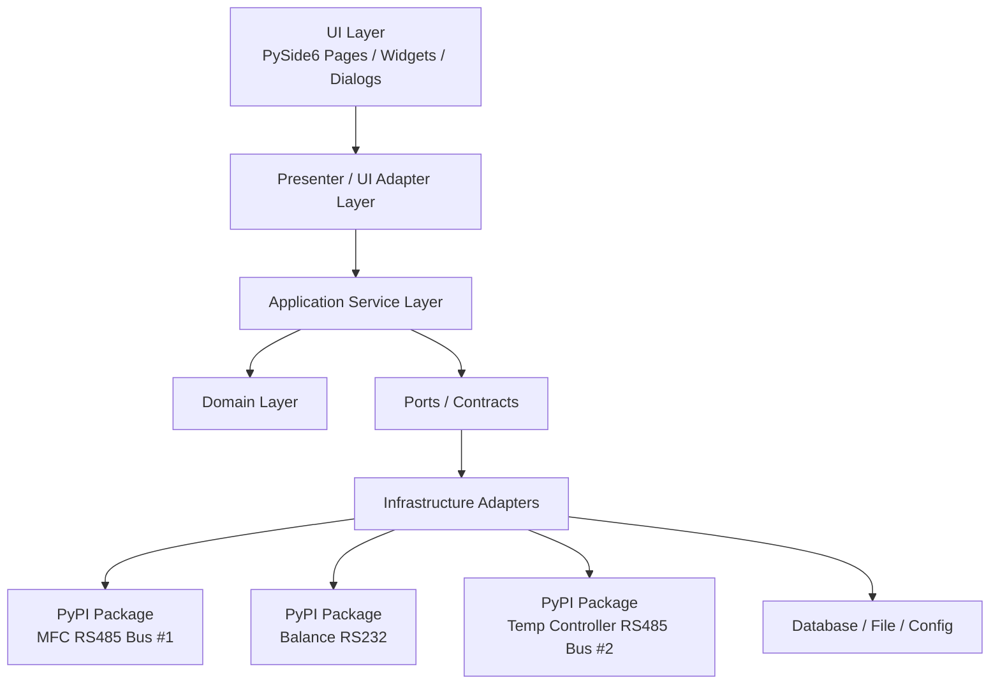

# TMH 架构重构蓝图

## 1. 文档目的

本文件用于对齐 TMH 下一轮架构优化目标，作为后续多 PR、多 agent 并行推进的统一设计基线。

本轮只做设计，不直接执行业务代码重构。

## 2. 目标与边界

### 2.1 目标

- 建立清晰的分层结构，降低 `UI / 业务流程 / 通信设备 / 数据存储` 之间的耦合。
- 将当前“页面直接编排业务”的模式收敛为 `View -> Presenter/Application Service -> Domain -> Infrastructure`。
- 将设备层拆为外部 PyPI 自定义包，通过 `requirements` 安装，主应用不再直接持有具体串口实现。
- 为多 agent 并行开发提供稳定的接口契约和 PR 边界。

### 2.2 本轮不做

- 不立即重写现有实验流程。
- 不一次性移除全部 Qt Signal / QTimer。
- 不直接替换所有设备客户端实现。
- 不在这一轮处理 UI 视觉优化。

## 3. 目标分层图



### 3.1 各层职责

- `UI Layer`
  - 只负责展示、收集输入、发出意图。
  - 不直接访问设备对象，不直接读写数据库/配置文件，不直接解析标准帧。

- `Presenter / UI Adapter Layer`
  - 负责将 UI 事件翻译为用例调用。
  - 负责把应用层输出映射为 UI DTO。
  - 负责确认框、输入框、提示消息等交互适配。

- `Application Service Layer`
  - 负责实验启动/停止、气体控制、初始重量设置、通信配置应用、导出等用例编排。
  - 依赖抽象 port，不依赖具体设备类和 Qt 控件。

- `Domain Layer`
  - 负责实验状态、状态迁移、实验模式、业务规则。
  - 逐步收敛为纯 Python 业务对象，减少 Qt 依赖。

- `Infrastructure Adapters`
  - 实现数据库、文件、配置、设备、协议适配。
  - 外部 PyPI 包和本地仓储适配器都归这一层。

## 4. 目标目录建议

```text
src/
├── app.py
├── application/
│   ├── services/
│   │   ├── experiment_workflow_service.py
│   │   ├── communication_service.py
│   │   ├── history_query_service.py
│   │   └── report_export_service.py
│   ├── ports/
│   │   ├── device_ports.py
│   │   ├── repository_ports.py
│   │   └── ui_ports.py
│   └── dto/
│       ├── device_snapshot.py
│       ├── experiment_dto.py
│       └── communication_dto.py
├── domain/
│   ├── experiment/
│   │   ├── state_machine.py
│   │   ├── entities.py
│   │   └── policies.py
│   └── shared/
├── infrastructure/
│   ├── runtime/
│   │   ├── app_runtime.py
│   │   └── experiment_runtime_adapter.py
│   ├── repositories/
│   │   ├── experiment_repository.py
│   │   └── comm_config_repository.py
│   ├── devices/
│   │   ├── device_manager_adapter.py
│   │   ├── mappers/
│   │   └── package_gateways/
│   └── ui/
│       └── qt_dialog_adapter.py
└── ui/
    ├── presenters/
    ├── adapters/
    ├── pages/
    ├── dialogs/
    └── ui_components/
```

说明：

- 这是目标形态，不要求一步到位。
- 初期可通过“新增目录 + 旧文件保留兼容代理”平滑迁移。

## 5. 设备层外部 PyPI 包方案

### 5.1 总体要求

主应用通过 `requirements.txt` 安装设备相关外部依赖，对主应用暴露为 3 个设备包。

推荐包名：

- `tmh-device-mfc`
- `tmh-device-balance`
- `tmh-device-temp`

如需把通信介质也显式写进包名，可采用别名风格：

- `tmh-device-mfc-rs485`
- `tmh-device-balance-rs232`
- `tmh-device-temp-rs485`

设备拆包约束：

- `MFC` 对应 `RS485 总线 1`，同一串口挂 4 台设备。
- `天平` 对应 `RS232`，1 台设备。
- `温控器` 对应 `RS485 总线 2`，1 台设备。

建议：

- 主应用直接依赖上面 3 个设备包。
- 当前仓库里的 `packages/tmh_comm` 保留为共享协议基础库更稳妥，负责协议编解码与 `StandardFrame` DTO。
- `DeviceManager` 与 `DataHandler` 的应用级聚合逻辑保留在主仓库，不建议随设备驱动一起外移。

### 5.2 推荐包边界

#### `tmh-device-mfc`

- 职责：
  - 管理单串口、多从站的 MFC 轮询与写入。
  - 暴露 4 路气体通道状态与设定能力。
  - 负责流量缩放、从站地址、命令优先级、串口复用。

- 配置输入：
  - 串口参数
  - 气体与从站地址映射
  - 流量缩放系数
  - 轮询间隔 / 超时

#### `tmh-device-balance`

- 职责：
  - 维护天平串口连接与连续读取。
  - 提供当前重量、去皮、连接状态。

- 配置输入：
  - 串口参数
  - 读取超时 / 刷新间隔

#### `tmh-device-temp`

- 职责：
  - 管理温控器串口读取。
  - 提供多通道温度快照。
  - 后续如设备支持写入设定值，可在同包扩展控制接口。

- 配置输入：
  - 串口参数
  - 从站地址
  - 起始寄存器 / 通道数 / scale / signed

### 5.3 主应用与设备包的对接原则

- 主应用不直接 import 包内串口实现细节。
- 主应用只依赖 `application/ports/device_ports.py` 中定义的抽象接口。
- `infrastructure/devices/package_gateways/` 负责将外部 PyPI 包适配为应用层 port。
- `DeviceManager` 保留在主应用，负责将设备包输出聚合为统一快照或 `StandardFrame`。
- `DataHandler` 只消费聚合后的标准输出，不直接碰设备包内部对象。

## 6. 关键接口草案

以下为建议的契约方向，初版可以先按 `Protocol` 或 `ABC` 定义。

### 6.1 通用生命周期与健康检查

```python
from dataclasses import dataclass
from typing import Protocol, Optional


@dataclass
class HealthStatus:
    is_connected: bool
    is_running: bool
    last_update_ts: Optional[float]
    error_message: str = ""


class LifecyclePort(Protocol):
    def start(self) -> None: ...
    def stop(self) -> None: ...
    def health(self) -> HealthStatus: ...
```

### 6.2 标准设备快照 DTO

```python
from dataclasses import dataclass, field
from typing import Any, Optional


@dataclass
class DeviceSnapshot:
    device_name: str
    device_type: str
    timestamp: Optional[float]
    payload: dict[str, Any] = field(default_factory=dict)
    is_connected: bool = False
    is_running: bool = False
    error_message: str = ""
```

### 6.3 MFC 端口

```python
from typing import Protocol


class MfcPort(LifecyclePort, Protocol):
    def read_snapshot(self) -> DeviceSnapshot: ...
    def set_flow(self, gas_name: str, flow_lpm: float) -> bool: ...
    def read_all_flows(self) -> dict[str, dict]: ...
```

建议的 `payload` 结构：

```python
{
    "channels": {
        "H2": {"pv": 0.0, "sv": 0.0, "slave_address": 1},
        "N2": {"pv": 0.0, "sv": 0.0, "slave_address": 2},
        "CO2": {"pv": 0.0, "sv": 0.0, "slave_address": 3},
        "CO": {"pv": 0.0, "sv": 0.0, "slave_address": 4},
    }
}
```

### 6.4 天平端口

```python
from typing import Protocol, Optional


class BalancePort(LifecyclePort, Protocol):
    def read_snapshot(self) -> DeviceSnapshot: ...
    def get_weight(self) -> Optional[float]: ...
    def tare(self) -> bool: ...
```

### 6.5 温控器端口

```python
from typing import Protocol, Optional


class TemperaturePort(LifecyclePort, Protocol):
    def read_snapshot(self) -> DeviceSnapshot: ...
    def read_temperatures(self) -> dict[str, Optional[float]]: ...
    def get_temperature(self, channel: str) -> Optional[float]: ...
```

### 6.6 设备聚合端口

```python
from typing import Protocol


class DeviceHubPort(Protocol):
    def start_all(self) -> None: ...
    def stop_all(self) -> None: ...
    def get_snapshots(self) -> dict[str, DeviceSnapshot]: ...
    def get_comm_status(self) -> HealthStatus: ...
    def set_flow(self, gas_name: str, flow_lpm: float) -> bool: ...
    def tare_balance(self) -> bool: ...
```

说明：

- `DeviceManager` 后续应退化为 `DeviceHubPort` 的一个适配实现。
- UI 和 `ExperimentController` 不应再直接触达 `balance/temp/multi_mfc` 等内部属性。

### 6.7 数据采集端口

```python
from typing import Protocol


class SnapshotCollectorPort(Protocol):
    def start(self) -> None: ...
    def stop(self) -> None: ...
    def latest_snapshot_bundle(self) -> dict[str, DeviceSnapshot]: ...
```

目标：

- `DataHandler` 只依赖稳定快照，不依赖具体设备对象结构。
- `DataHandler` 不直接读取配置文件，而通过配置仓储或初始化参数注入采样设置。

### 6.8 UI 交互端口

```python
from typing import Protocol, Tuple


class UserInteractionPort(Protocol):
    def confirm(self, title: str, message: str, default_no: bool = False) -> bool: ...
    def input_float(
        self,
        title: str,
        label: str,
        value: float,
        min_value: float,
        max_value: float,
        decimals: int,
    ) -> Tuple[float, bool]: ...
    def show_info(self, title: str, message: str) -> None: ...
    def show_error(self, title: str, message: str) -> None: ...
```

目标：

- 将当前 `ExperimentController` 中通过 Qt callback 注入的交互方式，升级成稳定的交互 port。
- Presenter 或 Qt adapter 实现该接口，应用服务只依赖这个抽象。

### 6.9 仓储端口

```python
from typing import Protocol, Optional


class ExperimentRepositoryPort(Protocol):
    def create_experiment(self, payload: dict) -> str: ...
    def append_data_point(self, experiment_id: str, payload: dict) -> None: ...
    def finish_experiment(self, experiment_id: str, payload: dict) -> None: ...


class CommConfigRepositoryPort(Protocol):
    def load(self) -> dict: ...
    def save(self, config: dict) -> None: ...
```

## 7. 设备包公开 API 草案

### 7.1 `tmh-device-mfc`

```python
from dataclasses import dataclass


@dataclass
class MfcDeviceConfig:
    port: str
    baudrate: int
    bytesize: int
    parity: str
    stopbits: int
    timeout: float
    slave_addresses: dict[str, int]
    flow_scaling: dict[str, float]
    poll_interval: float


class MfcDevice:
    def __init__(self, config: MfcDeviceConfig): ...
    def start(self) -> None: ...
    def stop(self) -> None: ...
    def health(self) -> HealthStatus: ...
    def read_snapshot(self) -> DeviceSnapshot: ...
    def set_flow(self, gas_name: str, flow_lpm: float) -> bool: ...
    def get_latest_data(self, gas_name: str | None = None) -> dict | None: ...
```

### 7.2 `tmh-device-balance`

```python
from dataclasses import dataclass


@dataclass
class BalanceDeviceConfig:
    port: str
    baudrate: int
    bytesize: int
    parity: str
    stopbits: int
    timeout: float
    read_interval: float


class BalanceClient:
    def __init__(self, config: BalanceDeviceConfig): ...
    def start(self) -> None: ...
    def stop(self) -> None: ...
    def health(self) -> HealthStatus: ...
    def read_snapshot(self) -> DeviceSnapshot: ...
    def get_weight(self) -> float | None: ...
    def tare(self) -> bool: ...
    def get_latest_data(self) -> dict | None: ...
```

### 7.3 `tmh-device-temp`

```python
from dataclasses import dataclass


@dataclass
class TempDeviceConfig:
    port: str
    baudrate: int
    bytesize: int
    parity: str
    stopbits: int
    timeout: float
    slave_address: int
    start_reg: int
    reg_count: int
    scale: float
    signed_registers: bool
    temp_channels: list[str]
    poll_interval: float


class TempControllerClient:
    def __init__(self, config: TempDeviceConfig): ...
    def start(self) -> None: ...
    def stop(self) -> None: ...
    def health(self) -> HealthStatus: ...
    def read_snapshot(self) -> DeviceSnapshot: ...
    def read_temperatures(self) -> dict[str, float | None]: ...
    def get_temperature(self, channel: str) -> float | None: ...
    def get_latest_data(self) -> dict | None: ...
```

## 8. 配置与版本管理建议

### 8.1 requirements 管理

主应用建议直接依赖：

```text
tmh-device-mfc==0.1.*
tmh-device-balance==0.1.*
tmh-device-temp==0.1.*
```

如果保留共享基础包，可由设备包内部依赖：

```text
tmh-comm>=0.1,<0.2
```

### 8.2 版本策略

- 初期采用 `0.x` 语义化版本。
- 一旦主应用开始依赖稳定接口，设备包端口方法尽量只做增量扩展，不做破坏性重命名。
- 主应用为 3 个设备包单独锁版本，避免现场部署时“一个包升级把另两个包带坏”。

### 8.3 配置注入

建议将当前 `comm_config.json` 拆为：

- 主应用配置：采样频率、性能参数、实验配置。
- 设备连接配置：传入各包的 config dataclass。

目标原则：

- 应用层只知道“配置对象”，不知道底层 JSON 结构。
- 设备包不直接读取主应用路径，不依赖 `PathManager`。

## 9. 模拟测试与回归建议

### 9.1 设备包测试

- 每个包自带 fake transport / fake serial，用于协议单测。
- 每个包至少覆盖：
  - 连接失败
  - 正常读取
  - 超时重试
  - 断线重连
  - 配置错误

### 9.2 主应用契约测试

- 为 `DeviceHubPort`、`SnapshotCollectorPort`、`UserInteractionPort` 提供 fake 实现。
- 用 fake 设备验证：
  - 启动实验
  - 停止实验
  - 手动设置初始重量
  - 保存通信配置并重新应用

### 9.3 回归重点

- `start / stop / reset` 的副作用顺序不能变。
- `MFC` 流量缩放必须保持兼容。
- `T8` 等关键温度通道读取不能丢。
- 去皮与初始重量流程必须闭环。
- `HistoryQuery` 导出字段和报告模板不能无声漂移。

## 10. PR 拆分表

| PR | 目标 | 主要文件/目录 | 输出 |
|---|---|---|---|
| PR-1 | 冻结契约层 | `src/application/ports/`, `src/application/dto/` | 定义设备、交互、仓储、快照接口 |
| PR-2 | 收口装配根 | `src/ui/main_window.py`, `src/services/app_runtime.py` | 页面依赖注入，运行时职责收敛 |
| PR-3 | 拆集成控制页编排 | `src/ui/pages/integrated_control_page.py`, `src/ui/presenters/`, `src/application/services/experiment_workflow_service.py` | `IntegratedControlPage` 变薄 |
| PR-4 | 统一快照映射 | `src/ui/adapters/`, `src/ui/ui_components/chart_tabs.py`, `src/ui/ui_components/monitor_panel.py` | UI 不再直接解析底层 frame schema |
| PR-5 | 通信配置服务化 | `src/services/comm_settings.py`, `src/application/services/communication_service.py`, `src/infrastructure/repositories/` | 配置加载/保存/校验/应用分层 |
| PR-6 | 设备层 port-adapter 化 | `src/device_clients/`, `src/infrastructure/devices/` | `DeviceManager` 对齐 `DeviceHubPort` |
| PR-7 | 设备外部 PyPI 包接入 | `requirements*.txt`, `src/infrastructure/devices/package_gateways/` | 主应用改为接设备包 |
| PR-8 | 历史查询与导出服务化 | `src/ui/pages/history_query_page.py`, `src/application/services/history_query_service.py`, `src/application/services/report_export_service.py` | 页面不再承载数据库/导出流程 |
| PR-9 | 实验状态机纯化 | `src/models/experiment_state.py` 或迁移到 `src/domain/experiment/` | 降低 Domain 对 Qt 依赖 |

建议顺序：

- 先做 `PR-1`，它是后续多 PR 并行的契约基线。
- `PR-2/PR-3/PR-5` 可部分并行。
- `PR-6/PR-7` 需要和设备包开发同步。
- `PR-9` 最后做，避免一开始就碰高风险状态时序。

## 11. Agent 拆分表

| Agent | 责任范围 | 主要文件 | 交付物 |
|---|---|---|---|
| Agent 1 | UI / Presenter | `src/ui/main_window.py`, `src/ui/pages/`, `src/ui/ui_components/`, `src/ui/presenters/` | 页面瘦身、Presenter、UI DTO 映射 |
| Agent 2 | Application / Domain | `src/controllers/experiment_controller.py`, `src/services/experiment_runtime.py`, `src/services/experiment_facade.py`, `src/models/experiment_state.py`, `src/application/` | 用例服务、状态契约、兼容代理 |
| Agent 3 | Device / Infra / Package | `src/device_clients/`, `src/services/comm_settings.py`, `src/infrastructure/devices/`, `requirements*.txt` | 设备 port、包网关、PyPI 包接入方案 |
| 主 Agent | 架构守门与集成 | 全局 | 契约审查、依赖方向校验、PR 合并顺序、回归清单 |

### 11.1 Agent 3 特别约束

Agent 3 后续设计与实现时必须遵守：

- 主应用面向 3 个外部设备包，而不是面向具体串口类。
- `MFC` 作为“单总线多设备”建模，不要错误拆成 4 个独立包。
- 设备包配置必须由主应用注入，不允许设备包自行读取仓库内配置文件路径。
- 输出稳定 DTO，不把串口对象、线程锁、协议内部状态泄漏到应用层。

## 12. 迁移顺序建议

### Phase 1：契约冻结

- 建立 DTO、port、交互接口。
- 不动现有 UI 行为，仅新增抽象层。

### Phase 2：UI 变薄

- `MainWindow` 变成装配根。
- `IntegratedControlPage` 只保留 View 角色。
- `ChartTabs` / `MonitorPanel` 改为消费 UI DTO。

### Phase 3：业务编排收口

- 将 `ExperimentController` 中的用例编排迁入应用服务。
- `ExperimentRuntime` / `ExperimentFacade` 保留兼容代理职能。

### Phase 4：设备层替换

- 引入外部 PyPI 包。
- 用 package gateway 适配为内部 port。
- `DeviceManager` 转为聚合路由层。

### Phase 5：领域纯化

- 逐步将状态机从 Qt 适配壳中剥离。
- 收敛 Domain 与 Infrastructure 的边界。

## 13. 已知高风险点

- 当前存在接口漂移征兆：
  - 上层对 `DeviceManager.get_all_status()` 的期待与实际输出不完全一致。
  - `ExperimentController` 调用的数据接口与底层实现已有命名断裂。
- Qt `Signal`、线程、`QTimer` 的时序行为隐含较多，不能激进替换。
- 外部设备包接入后，现场部署与版本锁定必须严格管理。

## 14. 下一步建议

下一轮建议先执行 `PR-1`：

- 新增 `application/ports`
- 新增 `application/dto`
- 先定义而不替换实现
- 把这套接口作为后续多 agent 并行的“公共契约”

这样后面的 UI、业务、设备三个方向可以同时开工，不会因为边界未定而反复返工。
